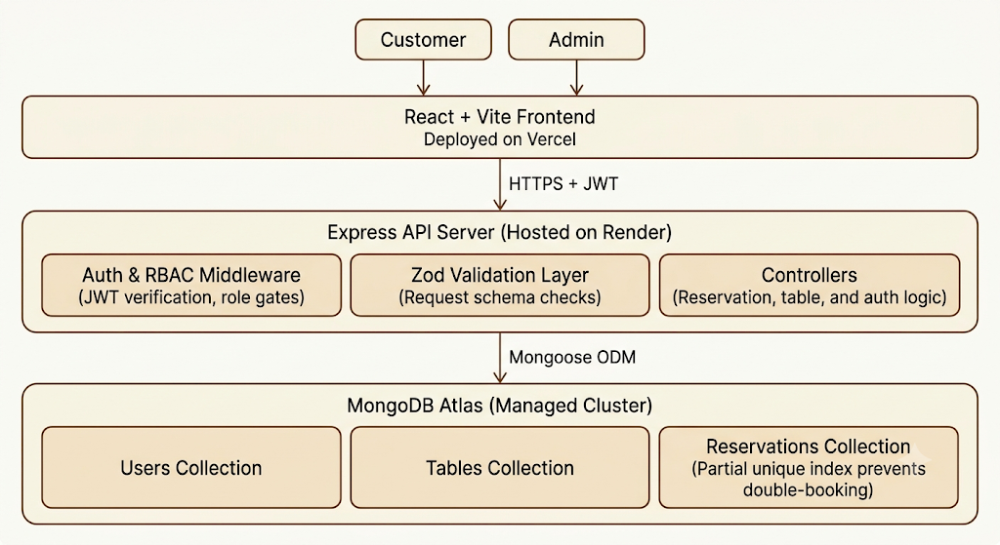

# TableSync - Restaurant Reservation Management System

TableSync is a full-stack restaurant reservation management system built using **Express (Node.js)** on the backend, **React (Vite)** on the frontend, and **MongoDB** as the database. 

The primary technical goal of this application is **guaranteed correctness under concurrent booking requests** (preventing double-bookings), which is achieved using a database-level MongoDB partial unique compound index.

---

## 🏗️ Architecture Overview



*Customer and admin requests flow through a JWT-authenticated Express API into MongoDB Atlas, where a partial unique index on the Reservations collection guarantees no double-bookings.*

---
## 🚀 Live Demo & Seed Credentials

- **GitHub Repository:** [github.com/Pranavipulluri/TableSync-ReservationManagement](https://github.com/Pranavipulluri/TableSync-ReservationManagement)
- **Frontend Client URL:** [table-sync-reservation-management-1s1en5hoi.vercel.app](https://table-sync-reservation-management-1s1en5hoi.vercel.app)
- **Backend API URL:** [tablesync-backend.onrender.com](https://tablesync-backend.onrender.com)

### Seed Accounts for Review:
You can log in directly using these pre-seeded accounts:
- **Administrator Login:**
  - **Email:** `admin@tablesync.com`
  - **Password:** `admin123`
- **Customer Login:**
  - **Email:** `customer@tablesync.com`
  - **Password:** `customer123`

---

## 🛠️ Setup & Installation Instructions

Ensure you have [Node.js](https://nodejs.org/) installed (v18+ recommended).

### 1. Clone & Portable Project Layout
All repository pathing and files are fully portable, and environment templates are provided.
```bash
git clone <repository-url>
cd TableSync_Reservation-management
```

### 2. Backend Setup
1. Navigate to the backend directory:
   ```bash
   cd backend
   ```
2. Install dependencies:
   ```bash
   npm install
   ```
3. Set up configurations by creating a `.env` file (see `.env.example`):
   ```env
   PORT=5000
   MONGO_URI=mongodb://localhost:27017/tablesync
   JWT_SECRET=your_jwt_secret_here  # Use a strong randomly generated secret in production
   NODE_ENV=development
   FRONTEND_URL=http://localhost:5173
   ```
4. Seed the database with the default tables and accounts:
   ```bash
   npm run seed
   ```
5. Run the integration test suite to verify correctness:
   ```bash
   npm test
   ```
6. Start the local development server:
   ```bash
   npm run dev
   ```

### 3. Frontend Setup
1. Navigate to the frontend directory:
   ```bash
   cd ../frontend
   ```
2. Install dependencies:
   ```bash
   npm install
   ```
3. Create a `.env` file (see `.env.example`):
   ```env
   VITE_API_URL=http://localhost:5000
   ```
4. Start the Vite React development server:
   ```bash
   npm run dev
   ```
   Open `http://localhost:5173` in your browser.

---

## 💡 Key Design Decisions & Core Correctness

### 1. Concurrency Control (Double-Booking Race Condition Prevention)
Most booking systems fall prey to the "check-then-write" race condition. When two users simultaneously check availability for the same table at the same slot, both see it as free, and both execute a write.

TableSync solves this at the database level by employing a **MongoDB partial unique compound index** on the `Reservation` collection:
```javascript
ReservationSchema.index(
  { table: 1, date: 1, timeSlot: 1 },
  { unique: true, partialFilterExpression: { status: 'confirmed' } }
);
```

#### Why a Partial Index?
- **Uniqueness Guarantee:** Only one `confirmed` reservation can exist for a specific table, date, and slot.
- **Support for Soft-Deletes:** Since cancelled reservations are excluded from the index, a customer can cancel their booking (`status: 'cancelled'`), immediately freeing up that table/slot to be booked again by someone else. Multiple cancelled reservations for the same table/slot can coexist in history without violating the unique constraint.
- **Race Condition Resolution:** If a race condition occurs, MongoDB throws a duplicate key error (code `11000`). The backend captures this exception inside the global `errorHandler.js` and returns a clean `409 Conflict` to the client.

### Concurrency Test Proof
We wrote a specialized simulation test at [concurrency_test.js](file:///d:/my%20projects/TableSync_Reservation-management/backend/tests/concurrency_test.js) to trigger two simultaneous bookings on the exact same table and slot. The output proves the safety guarantee:

```text
--- Starting Database Concurrency Race Condition Test ---
Connected to isolated MongoMemoryServer.
Fixtures created: Table 1 (capacity 4), User Alice, User Bob.
Simulating 2 simultaneous booking requests for Table 1, 2026-07-04, 18:00-19:00...

--- Test Results ---
Alice (Request 1): SUCCESS - Reservation saved. ID: 6a46a5ef1a4ea2267d35dec6
Bob (Request 2): FAILED - Error: E11000 duplicate key error collection: test.reservations index: table_1_date_1_timeSlot_1 dup key: { table: ObjectId('6a46a5ef1a4ea2267d35debc'), date: "2026-07-04", timeSlot: "18:00-19:00" }
  Error Code: 11000
  Is Duplicate Key Error (11000): true

--- Summary ---
Successful Bookings: 1 (Expected: 1)
Duplicate Key Failures: 1 (Expected: 1)
STATUS: SUCCESS. Database index successfully blocked the race condition!
```

### 2. Time Zones & Dates
To bypass timezone offsets between local browsers, Node servers, and UTC storage in MongoDB, dates are transmitted and stored as pure ISO string dates: `"YYYY-MM-DD"`.

### 3. Query Indexing
To support quick filtering when admins view bookings by date, a plain index is defined on `{ date: 1 }`, guaranteeing fast query performance for large reservation datasets.

### 4. Seating Efficiency & Table Assignment
The system auto-assigns the smallest fitting table by default but allows customers to override and select any available table that meets their capacity requirement, giving flexibility while defaulting to efficient seating.

### 5. Server-Side Validation Guarantees
Even if a client attempts to bypass the frontend constraints (using DevTools, Postman, or cURL), the backend enforces all business rules independently. These validation guards apply uniformly across both the customer reservation-creation flow and the admin reservation-update flow, ensuring guest count and capacity constraints cannot be bypassed by either role:

#### A. Guest Count Boundary Enforcements (1-8 guests)
Requests with guest counts outside limits are caught before entering controller layers by Zod middleware in `validator.js`:
```javascript
const reservationSchema = z.object({
  body: z.object({
    date: z.string().regex(/^\d{4}-\d{2}-\d{2}$/),
    timeSlot: z.enum([...]),
    guests: z.number().int().positive().max(8, { 
      message: 'Group size exceeds maximum table capacity (8 guests)' 
    }),
  })
});
```
- **Response:** `422 Unprocessable Entity`
- **Output:** `body.guests: Group size exceeds maximum table capacity (8 guests)`

#### B. Manual Table-Override Capacity Guards
If a customer attempts to manually select a table ID with insufficient capacity, the controller validates the table's capacity in `reservationController.js` during reservation creation:
```javascript
if (requestedTableId) {
  selectedTable = availableTables.find(t => t._id.toString() === requestedTableId);
  if (!selectedTable) {
    const dbTable = await Table.findById(requestedTableId);
    if (!dbTable) return res.status(404).json({ error: 'Table not found' });
    
    // Explicit capacity guard
    if (dbTable.capacity < guests) {
      return res.status(422).json({ 
        success: false, 
        error: `Table capacity (${dbTable.capacity}) is insufficient for ${guests} guests` 
      });
    }
  }
}
```
*Note: Happy-path table selections are pre-filtered via `Table.find({ capacity: { $gte: guests } })` in the availability checker utility.*
- **Response:** `422 Unprocessable Entity`
- **Output:** `Table capacity (capacity) is insufficient for X guests`
---

## 🔒 Security & Role-Based Access Control (RBAC)

The application implements JWT authentication with role gates.
- **Customer Role:**
  - Can register/login.
  - Can search availability for dates and slots.
  - Can create reservations (auto-assigned best-fit table or manually selected table).
  - Can view and self-cancel their own reservations.
  - **Forbidden** from accessing admin endpoints (returns `403 Forbidden`).
- **Admin Role:**
  - Has access to all reservations, searchable and filterable by date.
  - Can override, update (change date, slot, table, status), or cancel *any* customer reservation.
  - Can manage restaurant tables (view table layout, add new tables, delete existing tables).

---

## 📝 Assumptions & Scope Boundaries

- **Single Restaurant:** The app is configured for a single restaurant floor setup.
- **Fixed Seating Slots:** Seating is divided into fixed 1-hour time blocks (lunch and dinner splits) to make reservation logic highly predictable and correct.
- **No Payments:** Tables are booked on a reservation-only basis without integrated deposit structures.

---

## ⚠️ Known Limitations & Future Improvements

- **Cold Start Delay:** The backend is hosted on Render's free tier, which may take 20–30 seconds to spin up and respond to the first request after a period of inactivity.
- **No Overlapping Buffer support:** The current model uses discrete fixed time slots. With more time, a dynamic calendar system could calculate arbitrary durations with clean buffer offsets.
- **Waitlists:** In case of fully booked slots, a waitlisting system could hold queue positions and auto-book tables if another customer cancels.
- **Real-Time Updates:** Adding WebSockets would push instant table status updates to customers and administrators.
- **Interactive Floor Plan:** Replace standard grids with an SVG-based visual restaurant map representing active seating states.
